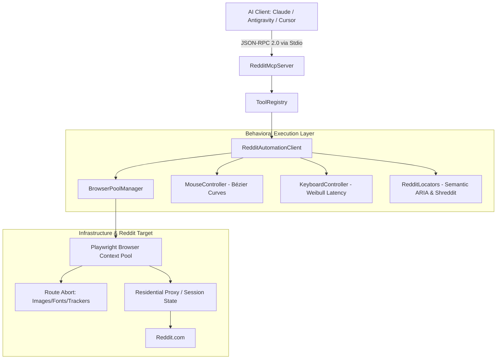

# 🛡️ Reddit MCP: Human-Mimetic Model Context Protocol Server

[](https://www.python.org/downloads/)
[](https://playwright.dev/)
[](https://modelcontextprotocol.io/)
[](https://github.com/sadik004/Reddit.mcp)
[](https://opensource.org/licenses/MIT)

A production-grade, standalone **Model Context Protocol (MCP)** server that equips AI assistants (Claude Desktop, Antigravity, Cursor, Cline) with **100% human-mimetic control over Reddit**.

Powered by behavioral automation principles, this server mimics real human interactions using cubic Bézier mouse curves, Weibull-distributed typing latency, single-browser multi-context pooling, and route-level asset abortion.

---

## 📑 Table of Contents

- [Key Capabilities](#-key-capabilities)
- [Architecture Overview](#-architecture-overview)
- [Tool Catalog (15 Tools)](#-tool-catalog)
- [Installation & Quickstart](#-installation--quickstart)
- [Authentication & Session Setup](#-authentication--session-setup)
- [MCP Client Configurations](#-mcp-client-configurations)
  - [Claude Desktop](#1-claude-desktop)
  - [Antigravity IDE / Cursor](#2-antigravity-ide--cursor)
- [Client Acquisition & Lead Generation Engine](#-client-acquisition-workflow)
- [Testing & Quality Gates](#-testing--quality-gates)
- [License](#-license)

---

## 🌟 Key Capabilities

1. **Human-Mimetic Dynamics**:
   - **Cubic Bézier Mouse Curves**: Generates organic acceleration, decelerations, and sub-pixel micro-jitters.
   - **Weibull Keystroke Delays**: Replicates natural human typing variance with punctuation pauses and burst cadence.
   - **Route-Level Asset Abortion**: Automatically drops images, fonts, tracking beacons, and media to save bandwidth and maximize DOM performance.
   - **Anti-Fingerprinting**: Strips `navigator.webdriver`, spoofs Chrome runtime objects, and configures realistic viewport dimensions.

2. **Full Lifecycle Reddit Control**:
   - **Profile Branding**: View and update display names, about bios, social links, and NSFW tags.
   - **Content Creation**: Post text/markdown and links to any subreddit (`r/...`) or personal profile (`u/me`).
   - **Community Engagement**: Reply to threads, post nested comments, cast upvotes/downvotes, and bookmark posts.
   - **Deep Discussion Extraction**: Recursively parses complete hierarchical comment trees to arbitrary depths.
   - **Discovery & Search**: Browse subreddits with custom sort orders and search Reddit with faceted filters.
   - **Direct Outreach**: Send direct private messages (PMs) and inspect inbox notifications.
   - **Commercial Lead Engine**: Discovers developers facing anti-bot/scraping blocks and generates authoritative technical pitches referencing open-source proof.

---

## 🏗️ Architecture Overview



---

## 🛠️ Tool Catalog

The server exposes **15 typed MCP tools** defined via Pydantic v2 DTOs:

| Category | Tool Name | Description |
| :--- | :--- | :--- |
| **Authentication** | `reddit_auth_status` | Audits current session validity, returning username, total karma, and notification count. |
| **Profile** | `reddit_get_profile` | Retrieves full profile details (display name, bio, karma breakdown, cake day, social links). |
| **Profile** | `reddit_update_profile` | Modifies profile display name, about bio, and NSFW toggles with human typing dynamics. |
| **Publishing** | `reddit_submit_post` | Publishes text/markdown or link posts to any subreddit or user profile (`u/me`). |
| **Publishing** | `reddit_submit_comment` | Submits top-level comments or nested replies to existing comments with human cadence. |
| **Engagement** | `reddit_vote` | Casts upvotes (+1), downvotes (-1), or clears votes (0) on posts/comments. |
| **Engagement** | `reddit_save_post` | Saves or unsaves posts and comments to account bookmarks. |
| **Intelligence** | `reddit_read_thread` | Extracts thread details and parses full recursive comment trees. |
| **Discovery** | `reddit_browse_subreddit` | Browses subreddit posts with sorting (`hot`, `new`, `top`, `rising`) and time filters. |
| **Discovery** | `reddit_browse_user` | Audits another user's submitted posts, comment history, and public metrics. |
| **Discovery** | `reddit_search` | Executes faceted searches across Reddit with subreddit, sort, and time horizon filters. |
| **Messaging** | `reddit_send_message` | Sends private direct messages (PMs) with subject and markdown content. |
| **Messaging** | `reddit_check_inbox` | Reads unread messages, mentions, and post/comment replies. |
| **Lead Gen** | `reddit_hunt_leads` | Scrapes target subreddits for actionable client problems and anti-bot hurdles. |
| **Lead Gen** | `reddit_generate_pitch` | Crafts authoritative technical solution pitches citing architectural proof. |

---

## 🚀 Installation & Quickstart

### 1. Clone & Set Up Virtual Environment

```bash
git clone https://github.com/sadik004/Reddit.mcp.git
cd Reddit.mcp

# Create virtual environment
python -m venv .venv

# Activate virtual environment
# Windows (PowerShell):
.venv\Scripts\Activate.ps1
# Linux/macOS:
source .venv/bin/activate
```

### 2. Install Dependencies

```bash
pip install -e .
playwright install chromium
```

---

## 🔐 Authentication & Session Setup

Reddit actively mitigates automated traffic on login endpoints. This MCP utilizes an interactive session exporter:

1. Run the interactive exporter:
   ```bash
   python scripts/login.py
   ```
2. A real Chromium browser window will launch navigating to `reddit.com/login`.
3. Complete your login manually, solving any 2FA or CAPTCHA challenges.
4. Once you reach the Reddit feed, press **ENTER** in your terminal.
5. The session cookies and storage tokens are safely saved to `storage_state.json`.

Subsequent MCP server runs will automatically load `storage_state.json` and operate in headless mode.

---

## ⚙️ MCP Client Configurations

### 1. Claude Desktop

Add this to your `claude_desktop_config.json`:

```json
{
  "mcpServers": {
    "reddit": {
      "command": "python",
      "args": ["-m", "reddit_mcp"],
      "cwd": "C:/path/to/Reddit.mcp/src",
      "env": {
        "REDDIT_STORAGE_STATE": "C:/path/to/Reddit.mcp/storage_state.json",
        "REDDIT_HEADLESS": "true"
      }
    }
  }
}
```

### 2. Antigravity IDE / Cursor

Add to your `.agents/mcp_config.json`:

```json
{
  "mcpServers": {
    "reddit-mcp": {
      "command": "python",
      "args": ["-m", "reddit_mcp"],
      "cwd": "${workspaceFolder}/Reddit.mcp/src",
      "env": {
        "REDDIT_STORAGE_STATE": "${workspaceFolder}/Reddit.mcp/storage_state.json",
        "REDDIT_HEADLESS": "true"
      }
    }
  }
}
```

---

## 💼 Client Acquisition Workflow

For freelance engineers and technical agencies seeking 2–3 high-value web automation contracts per month:

1. **Find Urgent Technical Bottlenecks**:
   ```json
   {
     "name": "reddit_hunt_leads",
     "arguments": {
       "subreddits": ["webscraping", "Python", "freelance"],
       "keywords": ["cloudflare turnstile", "403 forbidden", "playwright block", "hire scraper"],
       "min_urgency": 7
     }
   }
   ```

2. **Generate Technical Solution Pitch**:
   Feed the discovered lead DTO directly into `reddit_generate_pitch`:
   ```json
   {
     "name": "reddit_generate_pitch",
     "arguments": {
       "post_id": "t3_abc123",
       "title": "Cloudflare Turnstile blocking Playwright in headless mode",
       "author": "founder_john",
       "subreddit": "webscraping",
       "url": "https://reddit.com/r/webscraping/comments/abc123",
       "urgency_score": 9,
       "budget_intent": "High"
     }
   }
   ```

3. **Engage with Authoritative Value**:
   Publish the solution via `reddit_submit_comment` or send a direct message via `reddit_send_message` offering concrete open-source proof.

---

## 🧪 Testing & Quality Gates

Run the automated test suite with full coverage verification:

```bash
pytest tests/ -v
```

Run diagnostic stdio handshake:

```bash
python scripts/test_client.py
```

---

## 📄 License

Distributed under the **MIT License**. See [`LICENSE`](LICENSE) for details.
